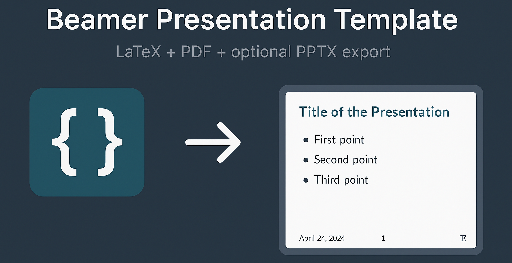

# Beamer Presentation Template



A clean, minimal **LaTeX Beamer** presentation template (16:9) with a custom footer featuring page count, date, and an optional institution logo. The style is inspired by the [Michigan Technological University](https://www.mtu.edu/) PowerPoint template. Write your slides in LaTeX, compile to PDF, and optionally export to images or PowerPoint.

## Features

- 16:9 widescreen layout with generous margins
- Custom footer: gray page count `(1/6)`, centered date, right-aligned logo
- Title page skips page numbering automatically
- Gold accent bullets for itemize/enumerate
- Side-by-side column layout for text + figures
- Section separators for organized source

## Installation

### 1. Install LaTeX

You need a TeX distribution with `pdflatex` and `latexmk`.

**Ubuntu / Debian / WSL:**

```bash
sudo apt install texlive-full latexmk
```

**macOS (Homebrew):**

```bash
brew install --cask mactex
```

**Windows:** install [MiKTeX](https://miktex.org/) or [TeX Live](https://tug.org/texlive/).

### 2. Editor setup (VS Code / Cursor)

Install the [LaTeX Workshop](https://marketplace.visualstudio.com/items?itemName=James-Yu.latex-workshop) extension. Once installed, saving any `.tex` file will automatically compile the PDF using `latexmk`. No extra configuration is needed.

### 3. Optional: Python packages for PPTX export

Only needed if you want to convert the PDF into PNG images and a PowerPoint file.

```bash
pip install -r requirements.txt
```

## Quick start

1. Clone this repo and open it in VS Code / Cursor.
2. Open `presentation.tex` and save it. LaTeX Workshop compiles the PDF automatically.
3. View the PDF in the editor tab that opens, or open `presentation.pdf` directly.

## How to modify the template

### Title, author, date

Edit these lines near the top of the document section in `presentation.tex`:

```tex
\title{Your Presentation Title}
\author{Your Name}
\institute{Your Institution}
\date{02/25/2026}
```

### Logo

The footer supports an optional logo on the right side. To set your own:

1. Place your logo image in the repo folder (e.g. `logo.png`).
2. Update the logo line in the preamble:

```tex
\renewcommand{\mylogo}{\raisebox{-0.15cm}{\includegraphics[height=0.45cm]{logo.png}}}
```

To remove the logo entirely, comment out that `\renewcommand` line.
Use a short, horizontal image so it fits the footer bar.

### Adding slides

Each slide is a `\begin{frame}...\end{frame}` block. Use section separators to keep the source organized:

```tex
%----------------------------------------------------------------------
\section{Your Section Name}
%----------------------------------------------------------------------
\begin{frame}{Slide Title}
  \begin{itemize}
    \item First point.
    \item Second point.
  \end{itemize}
\end{frame}
```

### Accent color

The default bullet color is gold (`#FFC000`). Change it in the preamble:

```tex
\definecolor{accent}{HTML}{FFC000}
```

## Compiling from the command line

If you prefer not to use LaTeX Workshop:

```bash
latexmk -pdf -interaction=nonstopmode presentation.tex
```

## Optional: export to images and PowerPoint

After compiling the PDF, you can convert it to PNG slides and package them into a `.pptx` file:

```bash
python3 export_slides.py          # PDF -> slides_export/*.png
python3 slides_to_pptx.py         # PNGs -> presentation.pptx
```

The PPTX output works in PowerPoint, Google Slides, or Keynote.

## Files

| File | Description |
|------|-------------|
| `presentation.tex` | Main Beamer template |
| `export_slides.py` | PDF to PNG export script |
| `slides_to_pptx.py` | PNG to PPTX builder |
| `requirements.txt` | Python dependencies (PyMuPDF, python-pptx) |
| `logo.png` | Placeholder footer logo (replace with your own) |

