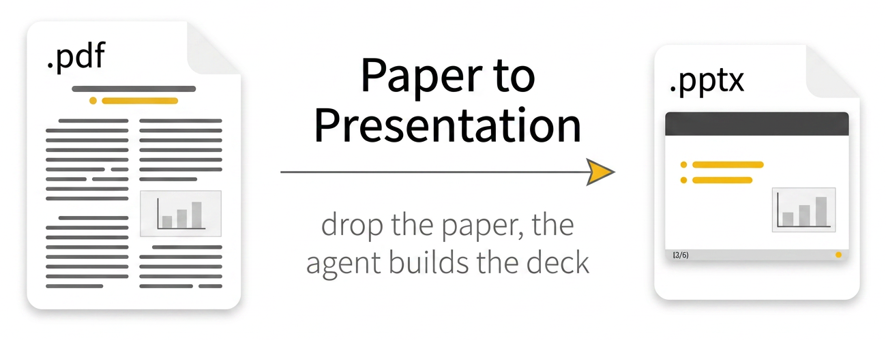

# Paper to Presentation



Turn a research paper into an editable PowerPoint presentation in one prompt. This repo bundles a clean **LaTeX Beamer** template (16:9), a Python converter (`beamer_to_pptx.py`), and Cursor rules that let the coding agent do the heavy lifting: read your paper, extract its figures, write the slide narrative, and produce both a PDF and an editable PPTX. The visual style is inspired by the [Michigan Technological University](https://www.mtu.edu/) PowerPoint template.

## The one-line workflow

1. **You** drop the paper into `Paper_files/`.
2. **You** tell the Cursor agent *"generate the slides"*.
3. **The agent** reads the paper, extracts the figures it needs into `Extracted_figures/`, edits `presentation.tex`, compiles the PDF, and builds the editable PPTX.

You never have to hand-extract figures from the paper or hand-copy files between folders. That division of labor is encoded in `.cursor/rules/presentation-slides.mdc` so Cursor follows it every time.

## Features

- **Paper-centric layout**: dedicated folders for the source paper (`Paper_files/`), agent-extracted figures (`Extracted_figures/`), and reusable deck assets (`Assets/`)
- **Agent-driven figure extraction**: you drop the paper, the agent pulls out the figures it wants to use and saves them into `Extracted_figures/` with readable filenames
- **Automatic figure collection on top**: whatever the agent misses, `beamer_to_pptx.py` still copies every `\includegraphics` source into `Extracted_figures/` as a safety net
- **One-step PPTX conversion** via `beamer_to_pptx.py` - each slide is a real PowerPoint slide with real bullets, titles, and textboxes (no image-flattening)
- **Smart table / TikZ cropping** driven by the PDF's own vector primitives, so extracted Beamer regions don't include surrounding captions or bullet text
- **Speaker notes ON by default** via `\note{...}` after each frame, carried into the PPTX Notes pane
- **Footer logo ON by default**, auto-discovered from `Assets/`
- 16:9 widescreen layout with generous margins and gold accent bullets
- Custom footer: gray page count `(1/6)`, centered date, right-aligned logo
- Title page skips page numbering automatically
- Side-by-side column layout for text + figures
- Section separators for organized source

## Folder layout

```
.
|- presentation.tex          # Main Beamer template (agent edits this)
|- presentation.pdf          # Compiled PDF (latexmk output)
|- beamer_to_pptx.py         # LaTeX -> editable PPTX converter
|- requirements.txt          # Python deps (PyMuPDF, python-pptx, Pillow)
|- Paper_files/              # YOU drop the paper here (starts empty)
|- Extracted_figures/        # AGENT + CONVERTER write here (starts empty)
|- Assets/                   # Logo, banner, and reusable graphics
|   |- logo.jpg
|   `- banner.png
`- .cursor/rules/            # Cursor rules that pin the workflow
```

Two folders ship **empty on purpose**:

- `Paper_files/` - **you** drop your paper here before you ask for slides. The source PDF is all that's strictly required; if you also have the paper's `.tex` / `.bib` / supplementary, drop those too so the agent has more to work with. You do **not** need to pre-extract figures.
- `Extracted_figures/` - **populated by the agent and the converter, not by you**:
  - When you ask Cursor to generate the slides, the agent reads your paper from `Paper_files/` and saves the figures it plans to use into this folder with descriptive filenames (e.g. `architecture.png`, `results_table.png`).
  - When `beamer_to_pptx.py` runs, it also copies every `\includegraphics` source file it encounters into this folder - belt-and-braces, so nothing is missed - and writes auto-cropped TikZ/table PNGs here as `slide_content_<N>.png`. Auto-cropped filenames are git-ignored; agent-extracted figures are tracked.

`\graphicspath{{Extracted_figures/}{Paper_files/}{Assets/}}` is set in the template: `Extracted_figures/` is searched first (so agent-extracted and converter-copied figures are found immediately), then `Paper_files/`, then `Assets/`. Either way, you write `\includegraphics{figure1}` with no path prefix.

## Installation

### 1. Install LaTeX

You need a TeX distribution with `pdflatex` and `latexmk`.

**Ubuntu / Debian / WSL:**

```bash
sudo apt install texlive-full latexmk
```

**macOS (Homebrew):**

```bash
brew install --cask mactex
```

**Windows:** install [MiKTeX](https://miktex.org/) or [TeX Live](https://tug.org/texlive/).

### 2. Editor setup (VS Code / Cursor)

Install the [LaTeX Workshop](https://marketplace.visualstudio.com/items?itemName=James-Yu.latex-workshop) extension. Once installed, saving any `.tex` file will automatically compile the PDF using `latexmk`.

### 3. Python packages for PPTX export

```bash
pip install -r requirements.txt
```

## Quick start

```bash
git clone https://github.com/Ali-Awad/paper-to-presentation.git
cd paper-to-presentation
pip install -r requirements.txt
```

Then:

1. **Drop the paper into `Paper_files/`.** That folder starts empty. Put the paper PDF (and any `.tex` / `.bib` / supplementary you have) there. You do not need to pre-extract figures - the agent does that in the next step.
2. **(Optional) put your institution logo in `Assets/`** as `logo.jpg` or `logo.png` - a placeholder logo ships with the repo; replace it with your own.
3. **Ask the Cursor agent to generate the slides.** A one-liner like "generate the slides from the paper I just dropped in `Paper_files/`" is enough. The agent will:
   - read the paper (and any accompanying source) from `Paper_files/`,
   - extract the figures it wants to use into `Extracted_figures/`,
   - update `presentation.tex` (title, author, date, body frames, `\note{...}` per frame),
   - compile the PDF with `latexmk -pdf -interaction=nonstopmode presentation.tex`,
   - build the editable PPTX with `python3 beamer_to_pptx.py presentation.tex`.

The outputs are `presentation.pdf` and `presentation_editable.pptx` alongside the `.tex`.

### Running the toolchain yourself

If you'd rather drive the build manually (e.g., after editing `presentation.tex`):

```bash
latexmk -pdf -interaction=nonstopmode presentation.tex
python3 beamer_to_pptx.py presentation.tex
```

The converter auto-detects `presentation.pdf` from the same basename (required for high-fidelity TikZ / table cropping).

## How to modify the template

### Title, author, date

Edit these lines near the top of the document section in `presentation.tex`:

```tex
\title{Your Presentation Title}
\author{Your Name}
\institute{Your Institution}
\date{02/25/2026}
```

### Logo

The logo is on by default and is read from `Assets/logo.jpg`.

- To change the logo, replace `Assets/logo.jpg` with your image (use a short, horizontal file so it fits the footer bar).
- To use a different path or filename, edit the `\renewcommand{\mylogo}{...}` line in the preamble.
- To remove the logo entirely, comment out the `\renewcommand{\mylogo}` line.

The converter auto-discovers any `\includegraphics` path containing `logo`, and falls back to `Assets/logo.jpg` / `Assets/logo.png` if nothing is found in the `.tex`.

### Figures from the paper

You should not need to touch figures by hand. The agent extracts them from the paper PDF into `Extracted_figures/` and references them from `presentation.tex` by **filename only**:

```tex
\includegraphics[width=\linewidth,height=0.58\textheight,keepaspectratio]{figure1}
```

Because `\graphicspath` lists `Extracted_figures/` first, LaTeX finds the file without a path prefix. If you'd like to swap in a different figure, just save it under `Extracted_figures/` (or `Paper_files/`) with the same basename.

### Adding slides

Each slide is a `\begin{frame}...\end{frame}` block followed by a `\note{...}` for speaker notes:

```tex
%----------------------------------------------------------------------
\section{Your Section Name}
%----------------------------------------------------------------------
\begin{frame}{Slide Title}
  \begin{itemize}
    \item First point.
    \item Second point.
  \end{itemize}
\end{frame}
\note{Explain the first point in more detail here. These notes appear in the PPTX Notes pane.}
```

Beamer silently ignores `\note{...}` in the normal PDF output, so your audience-facing PDF stays clean while the PPTX export retains your speaker notes.

**Readable slides:** keep each body bullet to a **short, scannable line** on 16:9 when you can. Long explanations belong in **speaker notes** (`\note{...}` on the line after `\end{frame}`) or in **sub-bullets**, not in a single long `\item`.

### Accent color

The default bullet color is gold (`#FFC000`). Change it in the preamble:

```tex
\definecolor{accent}{HTML}{FFC000}
```

## Compiling from the command line

If you prefer not to use LaTeX Workshop:

```bash
latexmk -pdf -interaction=nonstopmode presentation.tex
```

## How the PPTX export works

`beamer_to_pptx.py` parses the `.tex` into slide structures (title, bullets, columns, images, notes) and rebuilds each slide using editable PowerPoint objects - not as a flat image.

For every `\includegraphics{figure}` it encounters, it:

- resolves the path against `\graphicspath` (searching `Extracted_figures/`, then `Paper_files/`, then `Assets/`, then the repo root);
- if the resolved file lives outside `Extracted_figures/`, **copies it into `Extracted_figures/`** (no overwrite if an identically-sized copy already exists) - this acts as a safety net on top of whatever the agent already extracted;
- embeds the copy in the generated slide.

The footer logo is treated as chrome and is **not** copied.

For frames that use `\begin{tikzpicture}` or `\begin{tabular}` (which have no direct PPTX equivalent), the script clip-rasterizes just the relevant region of the compiled PDF:

- It reads the PDF page's **vector drawings** (including booktabs rule lines) and **embedded image rects** to locate the element's own bounding box.
- It merges in only text blocks that lie inside that bbox's vertical range and horizontally overlap - so captions, side text, and bullet lists below the table are **not** pulled into the extracted image.
- When bullets coexist with a table on the same slide, the bottom of the crop is snapped to the table's last rule line.
- The cropped PNG is saved into `Extracted_figures/` as `slide_content_<N>.png` so your extracted-figure folder doubles as the converter's output cache. Auto-generated filenames are in `.gitignore` by default.

This replaces the previous full-page whitespace-band heuristic, which tended to leak captions and stray text into the extracted figure.

Usage:

```bash
python3 beamer_to_pptx.py presentation.tex                     # auto-detects presentation.pdf
python3 beamer_to_pptx.py presentation.tex out.pptx            # custom output name
python3 beamer_to_pptx.py presentation.tex my.pdf out.pptx     # explicit PDF + output
```

The PPTX output works in PowerPoint, Google Slides, or Keynote.

## Files

| Path | Description |
|------|-------------|
| `presentation.tex` | Main Beamer template (with `\note{...}` per frame) |
| `presentation.pdf` | Compiled PDF, also fed to the converter for fallback rasterization |
| `beamer_to_pptx.py` | Single-script LaTeX -> editable PPTX converter |
| `requirements.txt` | Python dependencies (PyMuPDF, python-pptx, Pillow) |
| `Paper_files/` | Paper PDF + optional `.tex` / `.bib` / supplementary. **Starts empty - you drop the paper here.** |
| `Extracted_figures/` | Figures the Cursor agent extracts from the paper, plus copies made by the converter and auto-cropped TikZ/table PNGs. **Starts empty - populated by the agent and the converter, not by you.** |
| `Assets/` | Logo, banner, and reusable graphics |
| `.cursor/rules/` | Cursor rules that pin the "drop paper, ask for slides" workflow |
